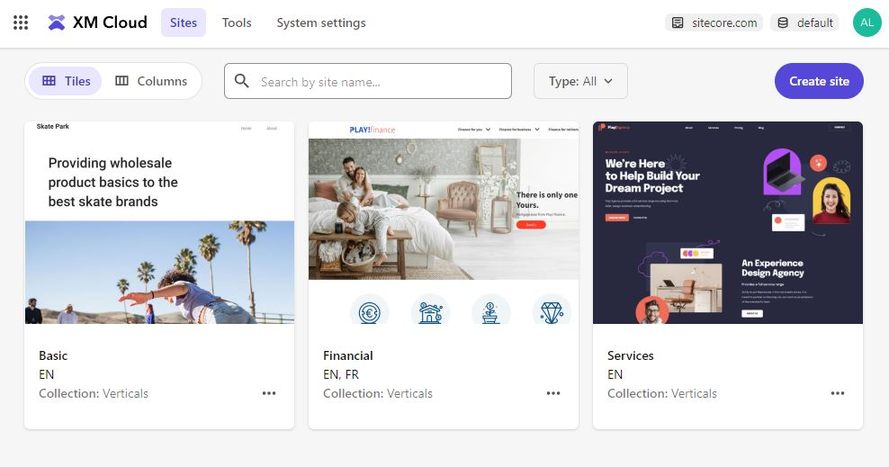

# Vertical Demos on XM Cloud

A headless multi-site solution focused on XM Cloud content and site management capabilities. Includes easily customizable sample sites for select industries.

✨ 42 beautiful custom components - enough to build any site you can dream up

🌍 Multisite support (3 sites ready to go, and more can easily be added)

🇨🇦 Multilingual (English and French-Canadian)

🌓 Light and dark themes

🔗 Single rendering host (with some magic to make it work for completely different sites)

🎨 Custom component variants/styles

🎯 Embedded Personalization

📄 Seamless integration with Pages



This repository is a Sitecore DXP demo that is based on [sitecorelabs/xmcloud-foundation-head](https://github.com/sitecorelabs/xmcloud-foundation-head) repository and uses:

- Sitecore XM Cloud
- Sitecore JavaScript Services (JSS)
- Next.js

You can deploy the demo in just a few clicks at [Sitecore Demo Portal](https://portal.sitecoredemo.com/), or use one of the quick starts below to run it locally.

## Quick start Astro (front-end app)

This is the easier way to get started, as long as you have access to XM Cloud. It does not require Docker and should work on any operating system supported by Node (Mac, Windows, Linux).

1. Deploy the project to XM Cloud

1. Download (from XM Cloud Deploy app / Developer Settings tab) and add the `.env.local` file to your app folder.

1. `cd src/sxastarter-nextjs`

1. Install dependencies and run your app.

   ```ps1
   npm install
   npm run dev
   ```

   Open http://localhost:3000 with your browser to see the result.

## Quick start Next.js (front-end app)

This is the easier way to get started, as long as you have access to XM Cloud. It does not require Docker and should work on any operating system supported by Node (Mac, Windows, Linux).

1. Deploy the project to XM Cloud

1. Download (from XM Cloud Deploy app / Developer Settings tab) and add the `.env.local` file to your app folder.

1. If for some reason you don't have acces to XM Cloud Deploy app / Developer Settings tab, you can find required values in the configuration of Vercel project: Settings / Environment Variables / SITECORE_EDGE_CONTEXT_ID and SITECORE_SITE_NAME.

1. `cd src/sxastarter-nextjs`

1. Install dependencies and run your app.

   ```ps1
   npm install
   npm run start:connected
   ```

   Open http://localhost:3000 with your browser to see the result.

## Quick start (Docker)

This will work only on Windows and deploy all Content Management roles and interfaces, as well as front-end app in a container.

1. In an ADMIN terminal:

   ```ps1
   .\up.ps1
   ```

   Open https://www.sxastarter.localhost with your browser to see the front-end of the website. Content Management UI will be available at https://xmcloudcm.localhost

2. Go to `/sitecore/system/Modules/Layout Service/Rendering Contents Resolvers/Datasource Item Children Resolver` and uncheck the `Include Server URL in Media URLs` checkbox.

## Updating color palette

Go to the `src\sxastarter\src\assets\sass\abstracts\vars` and update the colors in the `_colors.scss` file. Note, that each site has it's own color set for both light and dark theme.

Note, that each site has a special `site-*` class, this allows to apply custom CSS the specific site(s).